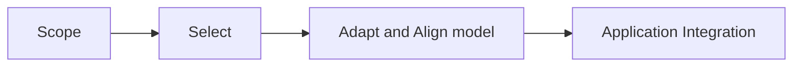
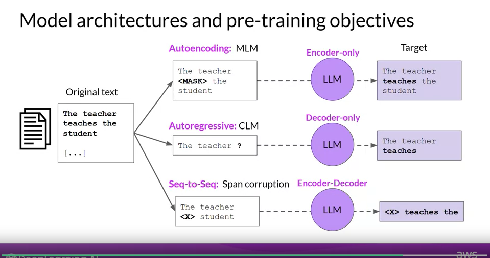
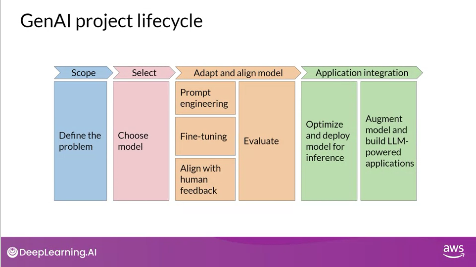

# Generative-ai-with-LLM

## Week 1: Introduction to LLMs and the generative AI project lifecycle

### Generative AI & LLMs

Fundation model or base model which ar pretrain model for example
 - BERT
 - GPT
 - LLaMa
 - FLAN-T5
 - BLOOM 
 - PaLM

 More parameters needs more memory and are capable of doing more complex task

 __Prompts and completions__: The text we pass to the model to perform a task is called prompt

__LLM use-cases and tasks__:
 
 - write an essey
 - translation
 - Code
 - Small focus task, Information retrieval like Nammed Recognition
 - Augmented LLM with external data sources
 

Text genertation before teransformers:
RNN - recurrent neural network 

Transformater Architecture:

Ref: https://arxiv.org/abs/1706.03762

In context learning:
zero-shot, one-shot, few-shot. 

Generative Configuration:
Max token: 
top-k sampling
top-p 
temperature

__Generative AI project Lifecycle__

__Pre-Training large language models__
Models hubs: 
Model Architectures and rpe-training objectives

### Encoder Only Models:
     Autoencoding models: They are trained on large amount of text data with a objective to predict the mask token [Mask language modelling]. They are taking consideration not only the previous tokens but also token after the word. That's means it is taking bidirection context to do the prediction. 

     
     Good use cases: 
            Classification like sentiment analysis,
            Named entitiy recognition
            Word classification 

    Example Models are: BERT, ROBERTA

### Decoder Only Models:
    Auto regressive models: Causal langauge Modeling (CLM). it is only consider the context from previous token so it is only cosidering unidirectional context and try to predict the next token. 

    Good use cases:
        Text generation
    
    Example: GPT, BLOOM

### Endcode Decoder Models:
    It is a sequence-to-sequence model and the training varies from model to model. For T5, it uses Span Corruption to mask randomly some words and then those mask words are replaced with a sentinel token. Sentinel token is not part of any word in the vocubulary. Decoder then predict the sentinel words. 

  Good use cases:
    Translation
    Text summerization
    Question Answering

  Example Model:
   - T5
   - BART

__Computational Challenges of training LLMs__

__Quantization__:

__Scaling laws and compute-optimal models__

# Week 2 Fine-tuning LLMs with instruction
 

 Catastrophic forgeting 
 
 Parameter efficient fine-tuning (PEFT)